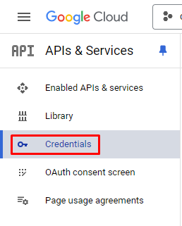
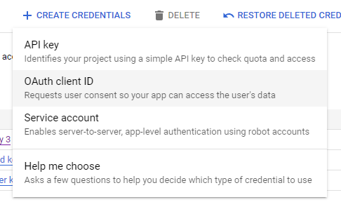
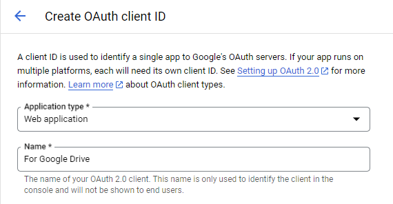
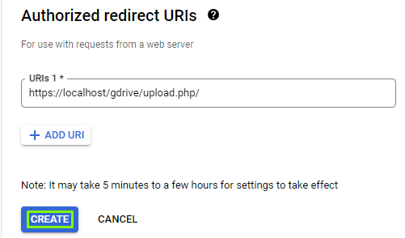
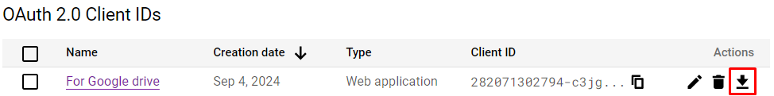
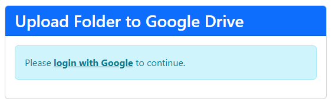
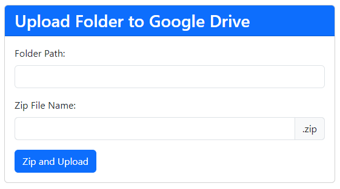
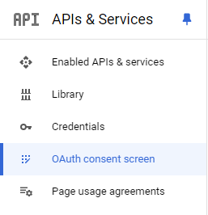
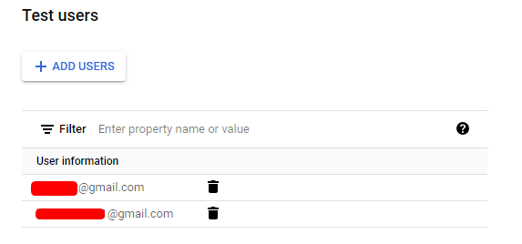

# Auto backup folder path to php

The first time is you have to download Google api php client

<dl>
  <dt>Google api php client</dt><dd><a href="https://github.com/googleapis/google-api-php-client/releases">https://github.com/googleapis/google-api-php-client/releases</a>
</dl>

## Create OAuth Credential File

To create this file, we can do it through the Google API Console. Before creating it, let's assume that we will be developing an application to upload files at the URL 'http://localhost/gdrive/upload.php'. This URL will be needed when creating the OAuth Credential file, as it must be registered first in the Google API.

Alright, let's start the process of creating the OAuth Credential file. After logging into the [Google API Console](https://console.developers.google.com/), go to the 'Credentials' menu located in the left sidebar.

After that click ‘Create Credentials’ in the top menu of the page, then select the submenu ‘OAuth client ID’

The next process is to determine the type of application, in this case because we are going to create a web application then selected ‘Web Application’ in the ‘Application Type ’ section. Also type the application name. The application name is in principle free, suppose in this example we name ‘For Google Drive’.

Still in the same form, see in the section ‘Authorized redirect URIs’. In this section, fill in the URL of the application that we are going to create, i.e. ‘http://localhost/gdrive/upload.php’

When finished, please click the ‘Create’ button.

If successful, the name of the application that we just created will appear. Next please download the file via the link provided.

After the file is downloaded, we will get a .json file with a file name that is quite long (on the client_secret_XXXXXX.json) where the file name is the client ID of our application. Because the name of the file is quite long, it can be renamed the name of the file, for example, with the name ‘oauth-credentials.json‘

## Run the code

<dl>
  <dt>Run XAMPP App : </dt>
  <dd>• Apache
  <dd>• MySQL
</dl>

After that just run the file [upload.php](https://localhost/gdrive/upload.php) on your browser, and click 'login with Google' and choose the email already add on 'Test users'

Finally, you can use the auto backup only input the path of folder

## If you wanna add more Test email

Goto the 'OAuth consent screen' and then scroll down until found 'Test users'

After add the email you can use the email for auto backup file with just input path folder
